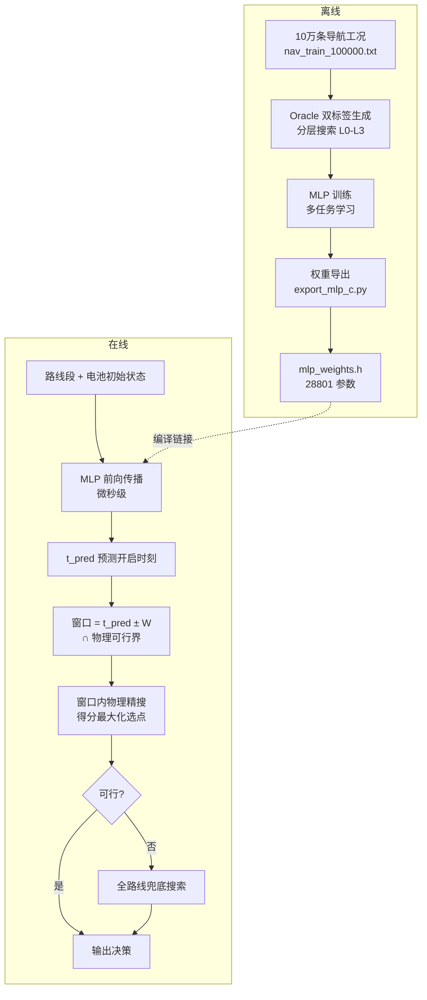

# 基于导航信息的电池充电温度预调 —— MLP 先验加速方案文档

> 核心定位：**MLP 的价值不在精度，而在速度**。机器学习的预测精度不可能超过物理搜索，
> 本方案利用 MLP 微秒级的推理速度给出"大致的搜索区间"，把物理仿真（毫秒级/次）限制在
> 小窗口内进行，从而实现 **"强化学习先验 + 物理搜索" 比 "纯物理搜索" 更快**，
> 精度则由窗口内的物理搜索兜底保证。

---

## 1. 问题背景

- 电动车冬季到达充电桩前，需决策**何时开启电池预热**（开启点用距充电桩的里程表示）。
- 目标：到达时电池温度落入 [20, 25] ℃、SOC ≥ 10%（硬约束），并在可行集内
  **最小化充电时间 + 预热能耗**（比赛公式：30 分充电时间 + 20 分能耗，可行集内 min-max 归一化）。
- 每评估一个"开启时刻"候选，都要跑一遍完整的电池热-电耦合仿真（积分上千步），
  全程 1 s 网格扫描一条路线平均需要 **~2,553 次仿真 / case**——这就是 MLP 要削减的成本。

## 2. 总体架构

两级分工：

| 层 | 执行者 | 耗时量级 | 职责 |
|---|---|---|---|
| 先验层 | MLP 前向传播 | ~微秒 | 给出最优开启时刻的粗估计 t_pred |
| 精确层 | 物理仿真搜索 | ~毫秒/次 | 在小窗口内逐点仿真，保证约束与得分 |

## 3. MLP 离线训练流程

### 3.1 数据与标签

- **数据**：`sdk/data/nav_train_100000.txt`，100,000 条工况，每条为 6 段导航
  （里程/车速/驱动功率/环境温度），初始状态固定 T=0 ℃、SOC=65%（与官方 Mock 一致）。
  划分：训练 1–80000，验证 80001–90000，测试 90001–100000。
- **Oracle 标签**：用**四层递进式分层搜索**（L0 10s 全局粗扫 → L1 1s 可行区间 →
  L2 0.1s 候选邻域 → L3 0.01s 审计）生成双份标签：
  - `raw`：真实约束 [20, 25] ℃ / SOC ≥ 10% 下的最优开启时刻；
  - `safe`：收紧约束（[20.05, 24.95] ℃ / SOC ≥ 10.05%）下的安全最优，用于训练（留裕度）。
  - 分层搜索自身已比同质量暴力搜索快 **17×**（1,067 vs 25,479 次评估，Δt=0 逐位一致），
    这是 10 万 case 标签可在数小时内完成的前提。

### 3.2 特征（30 维，与 `train_mlp.py build_features` 严格同序）

| 维度 | 内容 |
|---|---|
| 0–23 | 6 个导航段展开 `[s_km, v_kmh, P_drive_kW, T_env_C] × 6`（不足补 0） |
| 24–29 | `[T_init, SOC_init(%), 路线总时长(s), 总里程(km), 平均环温, 平均车速]` |

### 3.3 网络与损失

- 结构：`MLP(30 → 128 → 128 → 64)` backbone（ReLU），三个输出头：
  - 主头 `t`：开启时刻 / 路线总时长的分数，**sigmoid** 输出；
  - 辅头 `T_end`、`SOC_end`：到达温度与 SOC（多任务辅助监督）。
- 损失：主头 `Huber(β=0.02)` + 0.25 ×（两个辅头损失）；按验证集**秒级 MAE** 选型。
- 实测精度：验证集 MAE ≈ **49.5 s**；test 集 raw 直通约束通过率 100%，与 Oracle 最优
  得分差 3.47/50。开启时刻 MAE 分解：safe 标签偏移仅 ~3.5 s（51,854 双可行 case 实测），
  主体 ~42 s 是纯预测误差——这正是"MLP 只管粗定位、物理搜索管精度"的量化依据。

### 3.4 导出为 C 头文件

`ml/export_mlp_c.py` 把 PyTorch 权重（float32，**28,801 个参数**）展平导出为
`sdk/student_template/mlp_weights.h`：

- 常量：`MLP_IN_DIM=30`、`MLP_N_LAYERS=4`、`MLP_MAX_WIDTH=128`、`MLP_LAYER_IN/OUT[]`；
- 数据：`mlp_w0..3 / mlp_b0..3`（行主序）、归一化参数 `mlp_mu / mlp_sd`、指针表 `MLP_W[] / MLP_B[]`。

C 端手写前向（ping-pong 缓冲、中间层 ReLU、输出层 sigmoid），单次推理约 **3.8 µs**，
无任何运行时依赖。

## 4. 在线融合：两种接入形态

### 4.1 版本 A —— MLP 窗口搜索版（`sdk/student_template/student_solution.c`）

1. 物理引擎先定位可行开启区间（单调性剪枝：T_end 对开启时刻单调，端点秒判）；
2. MLP 预测 t_pred，取窗口 `[t_pred ± 60s] ∩ 可行界`；
3. 窗口内 1 s 网格物理仿真，批间 min-max 归一化选最优；
4. 窗口内无可行点 → 回退全程扫描（兜底，保证永不劣于纯搜索的可行性）。

Mock 路线实测：**121 次仿真 ≈ 全程扫描的 4.3%**，约束全过。

### 4.2 版本 B —— 快速引擎融合版（`sdk/student_template/student_solution_fast.c`）

在队友的快速引擎（双基线前缀缓存 1.0s/0.2s、二分定位三边界、自适应逐级精修
60s→5s→0.2s）上植入 MLP 先验：

- 仅把 **60 s 粗扫**限制在 `[t_pred ± 120s] ∩ 可行界`，交集 <30s 自动回退全程；
- 可行界两端点**始终评估**（最优解常贴边界，如 Mock 路线最优恰在可行窗最晚端点）；
- `#ifdef NO_MLP` 编译开关支持同代码 A/B 对比；
- `g_sim_calls / g_sim_steps` 计数器量化仿真量。

Mock 路线 A/B 结果（同一份代码、仅开关不同）：

| 指标 | MLP 引导版 | NO_MLP 基线 |
|---|---|---|
| 决策输出 | 29.64 km / 20.00℃ / 12.20% / 3.1772 kWh / 1030.53 s | **完全相同** |
| 后缀仿真次数 | 980 | 990 |
| 积分步总数 | 719.9 万 | 736.9 万 |

结论：零精度损失，但节省仅 ~1–2%——因为该引擎的自适应精修本身已把粗扫成本
压到总开销的 1% 以下。**MLP 加速的收益集中在"引擎不智能、粗扫占大头"的场景**。

## 5. 加速效果量化（核心数据）

离线评估（`ml/eval_window_search.py`，5,313 个可行 test case，共享仿真）：

| 方案 | 平均仿真次数 | 占全扫比例 | 得分差 mean | P95 | P99 |
|---|---|---|---|---|---|
| 全程 1s 全扫（基准） | ~2,553 | 100% | 0 | 0 | 0 |
| W60-batch（当前 C v1） | 296 | **11.6%** | 1.78 | 6.45 | 14.56 |
| W120-batch | 298 | **11.7%** | 1.74 | 5.02 | 7.67 |
| W120-fixed（固定比例选点） | 298 | 11.7% | 1.47 | 9.72 | 10.51 |
| W120-true（真实范围上界，上界参考） | 298 | 11.7% | 0.46 | 2.78 | 7.34 |

- **仿真量削减 8.6×**（2,553 → ~298 次），窗口失效回退全程的 case 仅 **2.24%**；
- 代价：平均得分差 ~1.7/50（约 3.5%），由批间 min-max 选点的局部范围失真导致
  （窗口内归一化基数被压缩，等效放大充电时间权重）。

### 5.1 为什么 MLP 能省这么多

| 环节 | 纯物理搜索 | MLP 先验 + 物理搜索 |
|---|---|---|
| 定位最优区间 | 全程 1s 扫描 ~2,553 次仿真 | MLP 前向 1 次（µs 级） |
| 精搜 | —（已是 1s 网格） | 窗口内 ~300 次仿真 |
| 失败兜底 | — | 2.24% case 回退全扫 |

MLP 的 49.5 s 级 MAE 足以把最优解圈进 ±60–120 s 窗口（覆盖 ~90%+ case），
这正是"预测不用准、只要不离谱"的设计哲学。

### 5.2 加速的上限与边界

- MLP 推理本身 **3.8 µs**，相对每次物理仿真（毫秒级）可忽略；
- 加速比 ≈ 全扫仿真数 / 窗口仿真数，当前约 **8.6×**；窗口越窄收益越大，
  但过窄会增加回退率与掉分风险（W60 的 P99=14.56 即证据）；
- 若底层引擎本身已有强剪枝（版本 B），MLP 的边际收益趋近于 0——
  **MLP 加速的对象是"笨重的系统性扫描"，不是"已经智能化的搜索"**。

## 6. 已知问题与改进方向

1. **批间选点失真**：窗口内 min-max 归一化使 30:20 的有效权重比例畸变
   （Mock 路线实测批选点 38.94 分 vs 窗内真实最优 41.25 分）。
   理论修正：得分排序等价于 `argmin(30·tch/R_C + 20·E/R_E)`，但 R_C 分布极宽
   （p5=0.34s ~ p95=38.78s，中位 8.6s），固定常数法 P95 反而更差（9.72），
   在线估计 R_C/R_E 是开放问题。
2. **窄窗盲区**：safe 约束下双可行窄窗 case 数为 0，全部被训练集排除——
   窄窗极端 case 是模型盲区（当前策略：物理搜索兜底，不影响可行性）。
3. **PPO 对比**：PPO 直通率 94.75% 但 MAE 125 s，劣于 MLP（49.5 s），
   故最终选型 MLP 作为先验层。
4. 版本 B 的进一步收益需把精修级联也限制在窗口内（有掉分风险，未实施）。

## 7. 文件清单

| 文件 | 说明 |
|---|---|
| `ml/train_mlp.py` | MLP 训练（特征、多任务损失、选型） |
| `ml/export_mlp_c.py` | 权重+归一化参数导出为 C 头文件 |
| `ml/preheat_env.py` | 物理仿真封装、评分、Oracle 加载 |
| `ml/eval_window_search.py` | 窗口搜索 4 变体离线评估 |
| `sdk/student_template/mlp_weights.h` | 导出的 28,801 参数 |
| `sdk/student_template/student_solution.c` | 版本 A：MLP 窗口搜索版 |
| `sdk/student_template/student_solution_fast.c` | 版本 B：快速引擎 + MLP 融合版（`-DNO_MLP` A/B 开关） |
| `oracle/oracle_generator.c` | 双 Oracle 标签生成器（分层搜索） |
