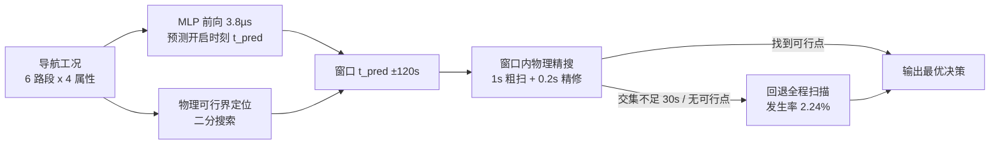

# 基于导航信息的电池充电温度预调 —— MLP 先验 + 物理搜索混合方案

2026 联电 USP 创新训练营项目。目标：在冬季行程中，依据导航信息决定**预热开启时刻**，
使电动车到达充电桩时电池温度落在 [20, 25] ℃、SOC ≥ 10%，并最小化充电时间与预热能耗
（官方 30:20 加权）。

## 方案一览

**核心思想**：MLP 的优势不是精度而是速度——用 3.8µs 的神经网络前向替代大部分毫秒级
物理仿真，圈定最优解所在的 ±120s 窗口，由物理仿真在窗口内精确收割，失败时全程扫描兜底。



### 关键结果（5,313 个测试 case，与训练集零重叠）

| 方案 | 仿真次数/case | 得分差* | 直通率 | 结论 |
|---|---|---|---|---|
| 纯物理全扫 | 2,553 | 0（基准） | 100% | 满分但重 |
| 纯 MLP 直出 | **1** | 17.15 | 67.8% | 1/3 违反硬约束 |
| MLP + PPO 直出 | **1** | 11.08 | 94.95% | 直通率升、精度反降 |
| **MLP 窗口 + 物理精搜** | **298（8.6×↓）** | **1.74** | 100% | **速度-质量甜点区** |

*得分差：与理论最优的分差（满分 50），不可行 case 按 0 分计。

### 方法论：两次碰壁与一次转向

1. **碰壁一（MLP 替代物理）**：物理仿真分辨率 0.2s，神经网络误差 ~50s，差两个数量级——
   直出方案 1/3 的 case 连硬约束都不满足；
2. **碰壁二（PPO 精调）**：RL 学会了"别犯错"（直通率 94.95%）却牺牲了"贴边做到最好"
   （MAE 翻倍、选点劣化）——本任务最优解由物理唯一决定，RL 没有发挥空间；
3. **转向**：重新提问后发现 MLP 的正确位置是**加速**而非**替代**——
   预测误差 50s 对"输出答案"是死刑，对"圈 ±120s 窗口"是通行证。

完整叙事见[方案演进-MLP从替代到加速.md](方案演进-MLP从替代到加速.md)，
技术细节见[MLP流程与加速作用.md](MLP流程与加速作用.md)。

## 目录结构

```
├── ml/                     # 机器学习全流程（Python）
│   ├── train_mlp.py        #   MLP 训练（30 维特征 → 128/128/64 → 三头，28,801 参数）
│   ├── ppo_finetune.py     #   PPO 微调实验（未进提交版，保留作证据）
│   ├── eval_direct.py      #   MLP/PPO 直出评估（67.8% / 94.95% 数据来源）
│   ├── eval_window_search.py  # 窗口搜索评估（8.6× 加速数据来源）
│   ├── eval_offline.py     #   安全层评估
│   ├── export_mlp_c.py     #   权重导出为 mlp_weights.h（C 端零依赖部署）
│   ├── cmp_v2_v4_mock.py   #   两版 C 引擎决策点得分裁决
│   ├── cmp_robust_mock.py  #   9 场景扰动鲁棒性测试
│   ├── plot_narrative.py   #   叙事配图生成
│   └── plots/              #   图表与评估数据
├── oracle/                 # 最优解标签生成器（C）
│   ├── oracle_generator.c  #   四层递进分层搜索，与暴力对拍 Δt=0（17× 加速）
│   ├── physics.c           #   物理引擎（与官方 mock 对拍一致）
│   └── output/             #   10 万条 safe/raw 双标签
├── sdk/
│   ├── student_template/
│   │   ├── student_solution_fast.c  # 提交版：自适应引擎 + MLP 先验融合
│   │   ├── student_solution(2).c    # 队友版：自适应精修引擎（融合基座）
│   │   ├── student_solution.c       # 早期版引擎
│   │   └── mlp_weights.h            # 28,801 个 float32 权重常量
│   ├── data/               # 官方训练工况（10 万条，39km 固定里程）
│   ├── include/            # 官方 API 头文件
│   └── antipinch/          # 另一道题：座椅防夹检测（完整方案）
├── prototype/              # 赛题原型验证（收敛性/鲁棒性数值实验）
├── 方案演进-MLP从替代到加速.md   # 叙事文档（含 4 张对比图）
├── MLP流程与加速作用.md          # 技术文档
├── 答辩准备-问答手册.md          # 28 问 + 评委三连问详解
└── 项目技术总结.md              # 项目总结
```

## 复现步骤

### 1. 环境

```bash
pip install -r ml/requirements.txt   # numpy / pandas / torch / matplotlib
```

C 端编译：MinGW-w64 GCC（Windows）。

### 2. 生成 Oracle 标签（已随库提供输出，可跳过）

```powershell
cd oracle
./build.sh            # 或 gcc -O2 -shared -o physics.dll physics.c
./run_oracle.ps1      # 10 万条工况，分层搜索 ~数小时
```

### 3. 训练与评估

```bash
cd ml
python train_mlp.py            # 监督训练（CPU 几分钟）
python ppo_finetune.py         # PPO 对比实验（可选）
python eval_direct.py          # 直出评估：MLP 67.8% vs PPO 94.95%
python eval_window_search.py   # 窗口搜索：2,553 → 298 次仿真（8.6×）
python export_mlp_c.py         # 导出 C 头文件 → sdk/student_template/mlp_weights.h
python plot_narrative.py       # 生成叙事配图
```

### 4. C 端构建与 A/B 验证

```powershell
cd sdk\student_template
# 提交版（自适应引擎 + MLP 先验）
gcc -O2 -std=c11 -I..\include -o run_fast.exe student_solution_fast.c -L..\lib -l:competition_mock.dll -lm
.\run_fast.exe    # 末尾 Performance 行：MLP-guided yes, 980 calls

# A/B 对照（同代码关掉 MLP）
gcc -O2 -std=c11 -DNO_MLP -I..\include -o run_base.exe student_solution_fast.c -L..\lib -l:competition_mock.dll -lm
.\run_base.exe    # 990 calls，输出与 MLP 版逐位一致
```

## 已知边界（诚实披露）

- **窄可行窗 case**：训练集天然缺失最难样本，由全程兜底保护（损失速度不损失精度）；
- **对高效引擎收益趋零**：MLP 收益 ∝ 引擎"笨重程度"——对全扫引擎 -88.3%，
  对自适应精修引擎仅 -1%（A/B 实测 980 vs 990）；
- **分布漂移**：MLP 失准仅导致回退率上升，决策正确性不受影响（最坏退化为纯物理基线）。

## 致谢

- 官方赛题与 SDK：联合汽车电子 USP 开发者平台；
- 物理参数、评分公式均以赛题文档为准。
