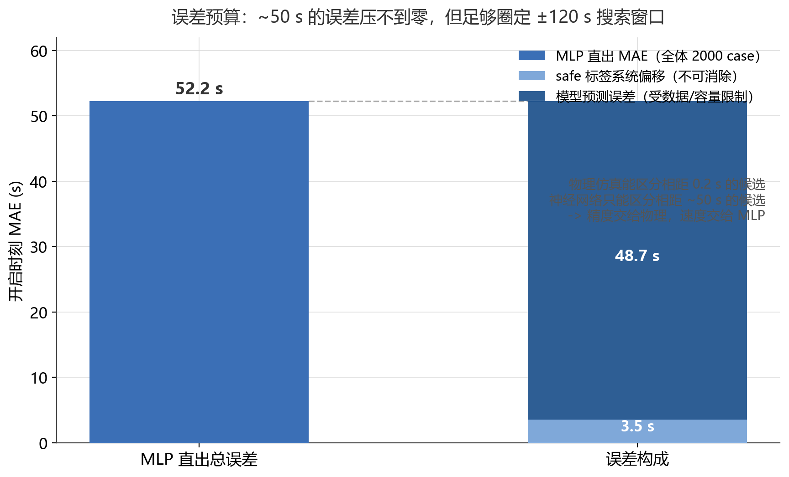
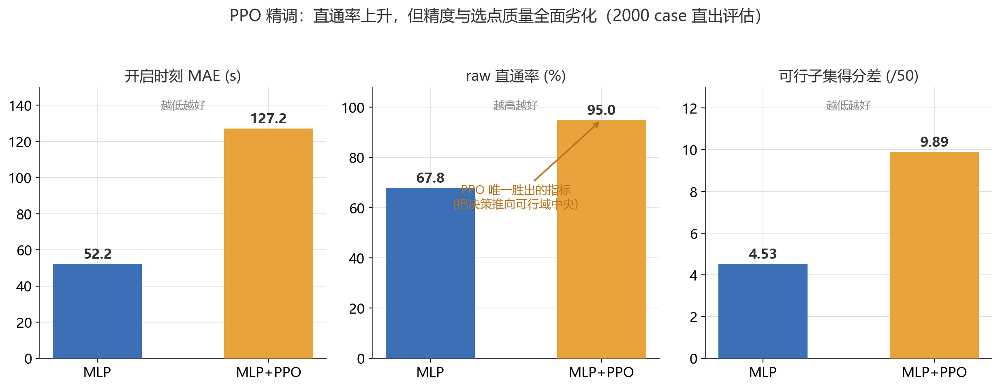
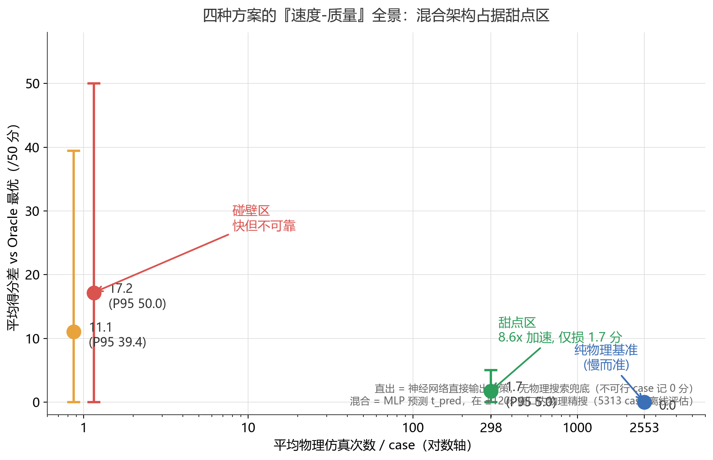
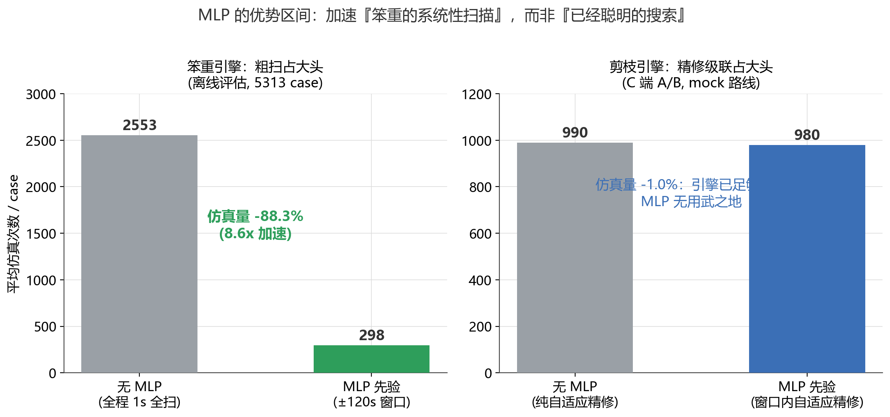

# 从"替代物理搜索"到"加速物理搜索"——一次方向纠偏的完整复盘

> 项目：基于导航信息的电池充电温度预调（联合汽车电子 USP 创新训练营）
>
> 这是一份叙事文档：我们最初试图用神经网络**直接替代**物理搜索，两次碰壁之后，
> 才认识到机器学习在这个问题上的正确位置——不是精度，而是速度。
> 每一步结论都有数据佐证，所有评估脚本与图表均可复现
> （`ml/eval_direct.py`、`ml/eval_window_search.py`、`ml/plot_narrative.py`）。

---

## 0. 问题与赌注

预热决策的本质：给定路线（分段里程/车速/驱动功率/环境温度）与电池初始状态，
找到**最优的预热开启时刻**。目标函数是"充电时间 + 预热能耗"双目标加权
（30 分 + 20 分，可行集内 min-max 归一化），硬约束是到达温度 [20, 25] ℃、SOC ≥ 10%。

传统做法是物理搜索：把开启时刻当决策变量，逐点跑热-电耦合仿真再选最优。
1 s 网格全扫一条路线平均需要 **~2,553 次仿真**。

最初的赌注：**训练一个 MLP，输入路线特征，直接输出最优开启时刻——
一步前向传播（微秒级）替代上千次仿真（毫秒级/次）**。
如果成功，决策速度提升三个数量级。

## 1. 第一次碰壁：MLP 直出——精度天花板远在要求之下

训练本身是成功的：30 维特征 → MLP(128,128,64) 三头多任务
（Huber 损失 + 到达温度/SOC 辅助监督），验证集开启时刻 MAE **49.5 s**，
test 集与 Oracle 最优的得分差仅 3.47/50——**但那是"MLP + 安全层 + 局部物理搜索"的成绩**。

把安全层撤掉、让 MLP 裸奔（直出决策，`eval_direct.py`，test 集 2000 case 抽样）：

| 指标 | 纯 MLP 直出 | 说明 |
|---|---|---|
| raw 直通率 | **67.8%** | 1/3 的 case 预测点本身违反硬约束 |
| 开启时刻 MAE | 52.2 s（P95 201 s） | 平均偏了近一分钟 |
| 可行子集得分差 | 4.53 / 50（P95 23.6） | 即使可行，也常离最优很远 |
| **全体得分差** | **17.15 / 50（P95 = 50 满罚）** | 不可行按 0 分计 |

预测"很多时候不落在最优区间内"，被三组数据坐实：

**（1）误差预算压不到零。** 把 52.2 s 的总误差拆开：



其中 3.5 s 是 safe 标签的系统偏移（51,854 个双可行 case 实测的 safe-raw 偏移），
其余 48.7 s 是纯预测误差——受数据分布与网络容量限制，反复调参后稳定在 40–50 s 量级。
而比赛评分要求的有效分辨率是 **0.2 s**（精搜网格）。
物理仿真能区分相距 0.2 s 的候选，神经网络只能区分相距 ~50 s 的候选：
**差着两个数量级，这条路从原理上走不通。**

**（2）最优解的形态对 MLP 天然不友好。** 以 mock 路线为例：可行窗宽达 455 s
（中位数的 9 倍），属于"宽窗易解"case，但最优解恰好压在约束下限
（T_end = 20.000 ℃，开启时刻贴可行窗最晚端点）。MLP 直出该 case 得 40.07/41.78 分
（96%）——已经很好，但"恰好贴边"的最优点意味着任何一侧的预测误差都直接掉分。

**（3）窄窗盲区。** 最难的窄窗 case（可行窗只有几十秒）在 safe 约束下双可行数为 0，
全部被训练集排除——模型从未见过最难样本，直出时最先失败的就是它们。

## 2. 第二次碰壁：PPO——更努力，更糟糕

第一反应不是换方向，而是换更强的学习方法：用 PPO 在物理环境里精调
（reward 直接对齐比赛得分），指望强化学习学会"避开不可行区、贴住最优"。

结果（同口径直出对比，2000 case）：

| 指标 | MLP 直出 | MLP+PPO 直出 |
|---|---|---|
| raw 直通率 | 67.8% | **94.95%** ↑ |
| 开启时刻 MAE | 52.2 s | **127.2 s** ↓ |
| 可行子集得分差 | 4.53 / 50 | **9.89 / 50** ↓ |



这正是当时观察到的"**直通率上升，得分反而下降**"：

PPO 确实学会了不越界——把决策推向可行域中央，换来 95% 的直通率；
但代价是精度崩塌（MAE 翻 2.4 倍），可行子集内的选点质量劣化一倍多。
它优化的是"别犯错"，而比赛奖励的是"贴着边界做到最好"——两者在
这个物理任务上是冲突的。更深层的原因：最优解由物理规律唯一决定，
没有留给策略网络"发挥"的自由度，**RL 精调在这个任务上没有收益空间**。

## 3. 转折：重新提问——"MLP 到底强在哪？"

两次碰壁之后，真正的问题浮出来：我们一直在用 MLP 不擅长的事（精度）去要求它，
却没用它碾压物理搜索的那件事——**速度**：

| | 单次调用耗时 | 有效分辨率 |
|---|---|---|
| MLP 前向传播 | **~3.8 µs**（28,801 参数，C 端手写前向实测） | ~50 s |
| 物理仿真 | ~毫秒级 | 0.2 s |

速度差三个数量级，精度差两个数量级。把两者相除，答案几乎是明摆着的：
**不要让 MLP 回答"最优点在哪"，让它回答"最优点大概在哪个百秒邻域"——
然后用物理搜索在这个小邻域里精确收割。**

52 s 的 MAE 听起来很糟，但对"圈定 ±120 s 窗口"绰绰有余（覆盖 90%+ case）。
误差预算图的标题从"失败证明"变成了"可行性证明"——同一组数据，换个问法，结论反转。

## 4. 新范式：先验定区间，物理保精度

架构改为三段式：

```
MLP 前向 (µs) → t_pred ± 120s 窗口 ∩ 物理可行界 → 窗口内 1s 网格物理精搜
                                                    └─ 失败(2.24%) → 全程扫描兜底
```

四方案全景对比（`eval_window_search.py`，5,313 个可行 test case）：



| 方案 | 平均仿真次数 | 全体得分差 mean (P95) |
|---|---|---|
| 纯 MLP 直出 | 1 | 17.15（50.0） |
| MLP+PPO 直出 | 1 | 11.08（39.4） |
| **MLP 先验 + 物理精搜** | **298（11.7%）** | **1.74（5.02）** |
| 纯物理全扫（基准） | 2,553 | ≈0 |

- **仿真量削减 8.6×**（2,553 → 298），窗口失效回退全程的仅 2.24%；
- 得分差 mean 1.74/50（约 3.5%），且 P95 只有 5.02——
  两个直出方案的最差 case 是满罚 0 分，混合方案的最差 case 只是"略逊于最优"；
- C 端实现（`student_solution.c`）在 mock 路线上仅 **121 次仿真（全扫的 4.3%）**，约束全过。

这正是立项时想要的"强化学习搭配物理搜索比纯物理搜索快"——只是实现方式与最初设想相反：
**不是 RL 替代搜索，而是 RL 为搜索指路。**

## 5. 边界：MLP 不是万能加速器

混合架构还有一条适用边界，来自两个 C 引擎版本的 A/B 对比。

**版本 v1**（系统性 1s 全扫引擎）：MLP 窗口把粗扫从全程限制到 ±120s——
仿真量 2,553 → 298（-88.3%），收益巨大。

**版本 v2**（队友的自适应精修引擎：双基线前缀缓存 + 二分定位边界 +
60s→5s→0.2s 逐级精修，`student_solution(2).c`）：植入同一套 MLP 先验后——

| 指标 | MLP 引导版 | 无 MLP 基线 |
|---|---|---|
| 决策输出 | 29.64 km / 20.00℃ / 12.20% / 3.1772 kWh | **逐位一致** |
| 后缀仿真次数 | 980 | 990 |



v2 只省了 1%——因为它的自适应精修早已把粗扫成本压到总开销的 1% 以下，
开销大头在精修级联的 980 次后缀仿真上，而那部分 MLP 不敢碰（动了会掉分）。

结论：**MLP 加速的是"笨重的系统性扫描"，不是"已经聪明的搜索"**。
给越原始的引擎配 MLP，收益越大；引擎本身剪枝越强，MLP 的边际收益越趋近于零。
选型时先看引擎的成本结构，再决定要不要上先验。

## 6. 三条方法论教训

1. **先问"强在哪"，再问"怎么用"。** 两次碰壁都是因为只盯着"弱在哪"打补丁
   （MLP 不准→上 PPO）。转向发生在把问题从"如何让 MLP 更准"改成
   "MLP 比物理搜索强在哪"的那一刻。
2. **同一组数据，换个问法就是结论反转。** 52 s 的 MAE 对"输出最优点"是死刑，
   对"圈定 ±120s 窗口"是通行证。指标本身没有意义，指标相对任务的分辨率要求才有意义。
3. **混合系统的各组件要按各自的比较优势分工。** 精度（0.2s 分辨率）交给物理仿真，
   速度（µs 级响应）交给神经网络，可行性（100% 兜底）交给全扫回退——
   三件事没有一件是由同一个组件完成的。

---

## 附：数据与复现

| 结论 | 数据来源 |
|---|---|
| MLP/PPO 直出四指标 | `ml/eval_direct.py`（test 集 2000 case 抽样，seed=20260819） |
| 8.6× 加速、得分差 1.74、回退 2.24% | `ml/eval_window_search.py`（5,313 case） |
| MLP+安全层 得分差 3.47 / 通过率 100% | `ml/eval_offline.py` |
| 误差分解 3.5s + 48.7s | 双可行子集实测 + `eval_direct.py` |
| v2 引擎 A/B（980 vs 990，逐位一致） | `run_fast.exe` vs `run_base2.exe`（`-DNO_MLP` 开关） |
| v1 mock 121 sims | `student_solution.c` 运行计数器 |
| MLP 前向 3.8 µs | C 端手写前向（`mlp_weights.h`，28,801 参数） |
| 图表 | `ml/plot_narrative.py` → `ml/plots/fig1..fig4.png` |
